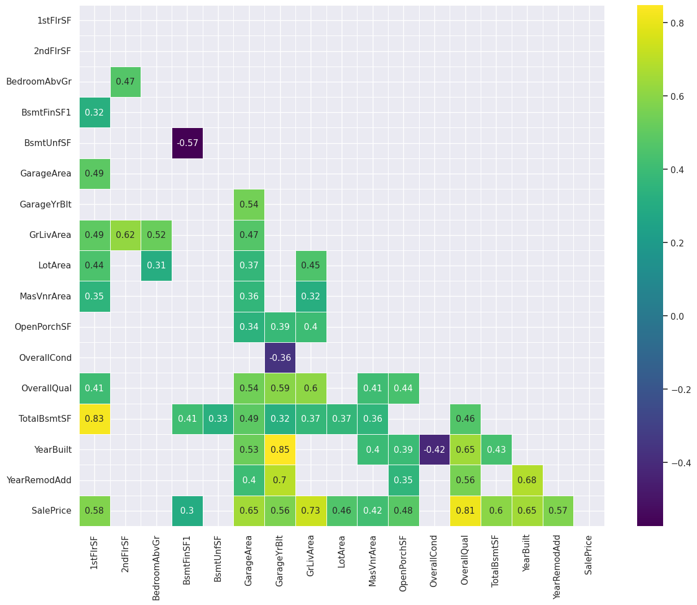
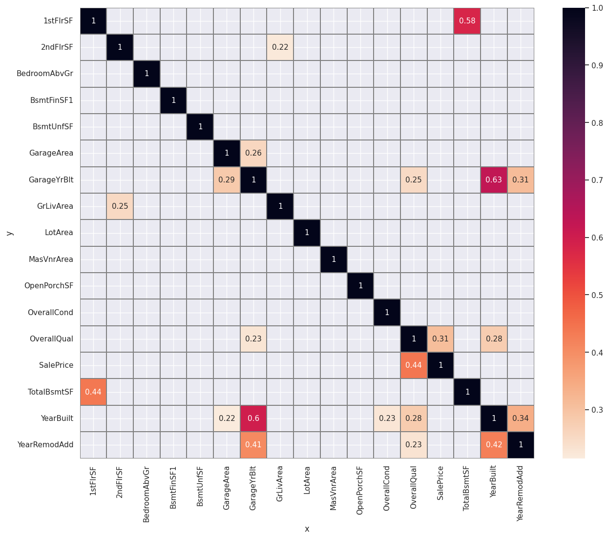
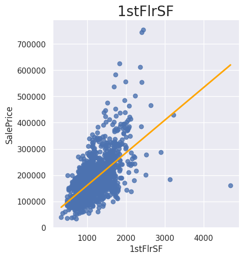
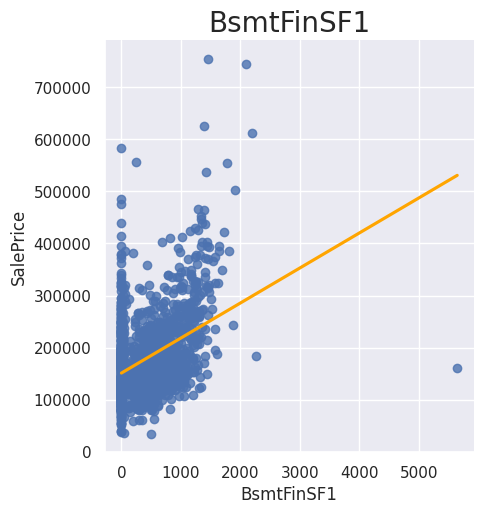
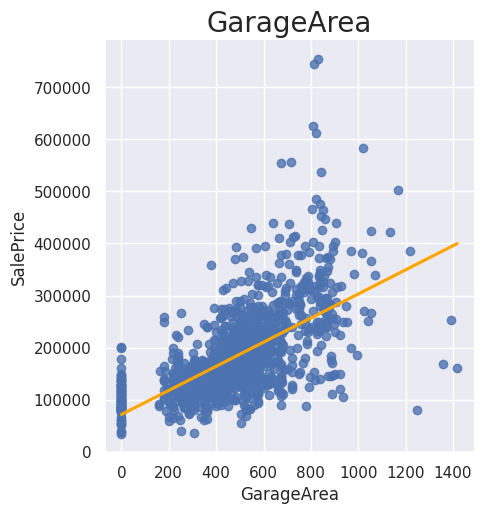
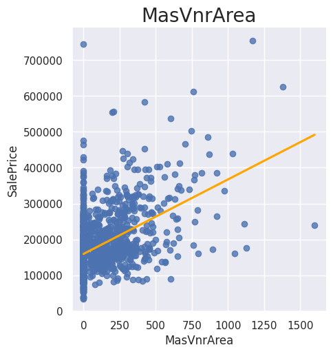
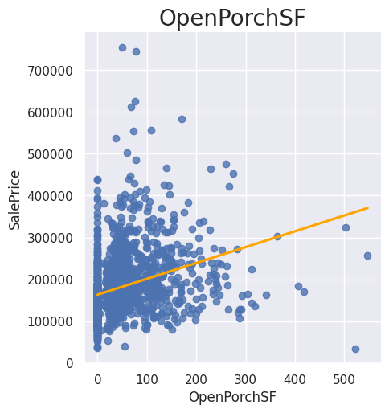
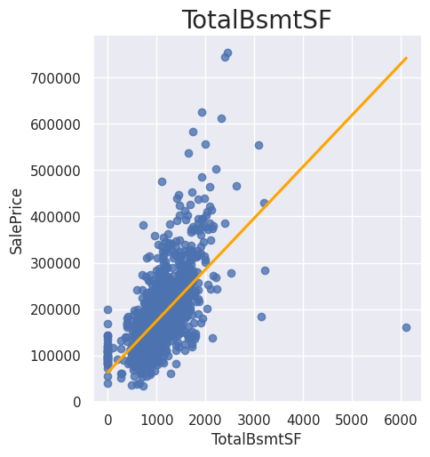

# Heritage Housing

## Introduction

- The project is aiming to apply Machine Learning and regression algorithms to accurately predict house prices in Ames, Iowa. 
- Our customer need to predict the prices for her 4 inherited houses and in this project we will give her a total sum for the houses and a model to calculate one house that will also be possible to use for you, the model will have a value to make it easy to understand how to put in own values
- The deployed project can be found here: https://heritage-housing.onrender.com/
- The README that you currently are reading can be found here: 
https://github.com/AlexanderAberg/heritage-housing-ames-iowa-usa/blob/main/README.md

## Dataset Content

- The dataset is sourced from [Kaggle](https://www.kaggle.com/codeinstitute/housing-prices-data). We then created a fictitious user story where predictive analytics can be applied in a real project in the workplace.
- The dataset has almost 1.5 thousand rows and represents housing records from Ames, Iowa, indicating house profile (Floor Area, Basement, Garage, Kitchen, Lot, Porch, Wood Deck, Year Built) and its respective sale price for houses built between 1872 and 2010.

|Variable|Meaning|Units|
|:----|:----|:----|
|1stFlrSF|First Floor square feet|334 - 4692|
|2ndFlrSF|Second-floor square feet|0 - 2065|
|BedroomAbvGr|Bedrooms above grade (does NOT include basement bedrooms)|0 - 8|
|BsmtExposure|Refers to walkout or garden level walls|Gd: Good Exposure; Av: Average Exposure; Mn: Minimum Exposure; No: No Exposure; None: No Basement|
|BsmtFinType1|Rating of basement finished area|GLQ: Good Living Quarters; ALQ: Average Living Quarters; BLQ: Below Average Living Quarters; Rec: Average Rec Room; LwQ: Low Quality; Unf: Unfinshed; None: No Basement|
|BsmtFinSF1|Type 1 finished square feet|0 - 5644|
|BsmtUnfSF|Unfinished square feet of basement area|0 - 2336|
|TotalBsmtSF|Total square feet of basement area|0 - 6110|
|GarageArea|Size of garage in square feet|0 - 1418|
|GarageFinish|Interior finish of the garage|Fin: Finished; RFn: Rough Finished; Unf: Unfinished; None: No Garage|
|GarageYrBlt|Year garage was built|1900 - 2010|
|GrLivArea|Above grade (ground) living area square feet|334 - 5642|
|KitchenQual|Kitchen quality|Ex: Excellent; Gd: Good; TA: Typical/Average; Fa: Fair; Po: Poor|
|LotArea| Lot size in square feet|1300 - 215245|
|LotFrontage| Linear feet of street connected to property|21 - 313|
|MasVnrArea|Masonry veneer area in square feet|0 - 1600|
|EnclosedPorch|Enclosed porch area in square feet|0 - 286|
|OpenPorchSF|Open porch area in square feet|0 - 547|
|OverallCond|Rates the overall condition of the house|10: Very Excellent; 9: Excellent; 8: Very Good; 7: Good; 6: Above Average; 5: Average; 4: Below Average; 3: Fair; 2: Poor; 1: Very Poor|
|OverallQual|Rates the overall material and finish of the house|10: Very Excellent; 9: Excellent; 8: Very Good; 7: Good; 6: Above Average; 5: Average; 4: Below Average; 3: Fair; 2: Poor; 1: Very Poor|
|WoodDeckSF|Wood deck area in square feet|0 - 736|
|YearBuilt|Original construction date|1872 - 2010|
|YearRemodAdd|Remodel date (same as construction date if no remodelling or additions)|1950 - 2010|
|SalePrice|Sale Price|34900 - 755000|

- We deleted BsmtExposure, BsmtFinType1, GarageFinish, KitchenQual, LotFrontage, 
EnclosedPorch and WoodDeckSF because the quality wasn't good enough.

## Business Requirements

- 1 - The client is interested in discovering how the house attributes correlate with the sale price. Therefore, the client expects data visualisations of the correlated variables against the sale price to show that.
- 2 - The client is interested in predicting the house sale price from her four inherited houses and any other house in Ames, Iowa.

## Hypothesis and how to validate?

- We believe that the size of the house and its features affect the SalePrice. We notice that it does, but it is not the most important feature, because quality has a higher effect and YearBuilt has a bigger importance than a few size related features.

- Our conclusion is that you have to take care of your to get a good SalePrice. This means that a big house with a big garage, porch, yard etc. will get a very high SalePrice if you are also keeping the house in great condition.

- We think that one of the reasons YearBuilt has a big effect because a new house is often in better condition, that can also be a reason why a house from 1940 has about the same SalePrice as one from 1960. The YearRemodAdd also has a decently high correlation, but much less because a variety of the quality of the house work, while a new house has to a big degree professionals building the house.

## Technologies Used
- Education Tool- From the people at Code Institute.
- The project - The base used from Code Institute.
- Mockup - Generated at amiresponsive
- GitHub for storing the project and deploying it
- GitHub CodeSpaces for project development
- Render for deploying the app.
- Kaggle for the dataset.

## Images on data, graphs, plots etc.

## Future
- In the future I need to improve this README.
- The graphic needs to be fixed where you write in data of your own house. 

## Deployment

### The project is deployed on Render, with following steps:

1. Log in to Render and create an App
2. At the Deploy tab, select GitHub as the deployment method.
3. Select your repository name and click Search. Once it is found, click Connect.
4. Choose the port and Python version in  “Add Environment Variable”.
5. Select the branch you want to deploy, then click Deploy Branch.

## Main Data Analysis and Machine Learning Libraries

- Used pandas, matplotlib, ydata, numpy, seasborn, ppscore, sklearn, spearman and
pearson for analysing and building the machine learning model.

## Credits

- Lino helped me much with tips, suggestion, to bounce ideas and bug fixes, 
the help included going through my notebooks, app pages, and his graphs as base,
you can find his GitHub here: https://github.com/linobollansee/ 
and his project here: https://github.com/linobollansee/property-value-maximize
- Freddy helped me with the app pages and ideas,  his GitHub can be found here: 
https://github.com/Profess0ro

### Content

- The content is based on the Code Institute's Walkthrough project and most
 of the learning has been taken from their learning material.

### Media

- Responsiveness - https://ui.dev/amiresponsive

## Acknowledgements (optional)

- I want to thank Lino again for all the help I got from him.
- Roman at Code Institute helped me by pointing out that I should use Render 
instead of Heroku, because Heroku caused big issues for a long time because of 
the size of slug being too large.

